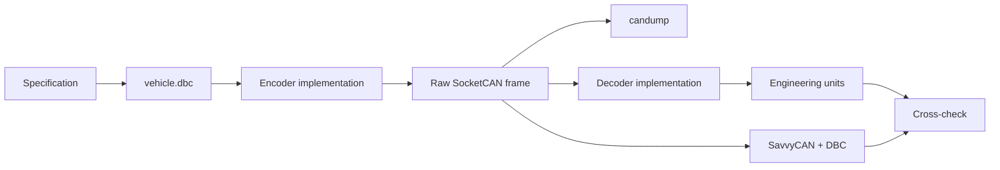

# AI-Assisted DBC Generation & Engineering Validation Report — Version B

## 1. Project Objective

This project uses AI assistance as a development aid for an automotive telemetry simulation built with:

- Vector-style DBC syntax;
- Linux SocketCAN;
- the Linux Virtual CAN interface `vcan0`;
- C-based CAN transmission and reception;
- independent raw-frame verification using `candump`;
- optional DBC visualization in SavvyCAN.

The required CAN network contains three standard frames:

| ID | Decimal | Message | Signals |
|---|---:|---|---|
| `0x100` | 256 | `VehicleStatus` | `VehicleSpeed`, `EngineRPM` |
| `0x101` | 257 | `ThermalFuel` | `CoolantTemperature`, `FuelLevel` |
| `0x102` | 258 | `PowerStatus` | `BatteryVoltage`, `AmbientTemperature` |

## 2. AI Tool Selection and Engineering Principle

AI systems such as Claude 3.5 Sonnet and ChatGPT-4o can be used for the stages requested in the assignment: DBC drafting, C-structure generation, documentation, mathematical checks, and troubleshooting.

The engineering principle used here is:

> AI output is treated as a candidate implementation, not as the final authority.

The final implementation is checked against the signal specification, raw-frame behavior, and inverse encoding/decoding mathematics.

### Historical-use clarification

This file describes the engineering workflow used to create and verify this project. It is not intended to fabricate a historical transcript of prompts that were never executed. A student should edit tool names or specific interaction details to match the tools they actually used.

## 3. Multi-Stage Prompt Engineering Strategy

### 3.1 Stage 1 — Requirement extraction

The initial request should force the model to preserve the fixed requirements:

- three CAN IDs;
- six signal names;
- DLC = 8;
- scaling and offsets;
- standard 11-bit CAN identifiers;
- strict Vector DBC syntax;
- SocketCAN on `vcan0`.

The model should not be allowed to invent different signal ranges or message IDs.

### 3.2 Stage 2 — Database-first development

The DBC should be completed before the C packing logic.

For this version, the selected signal locations are:

| Signal | Start Bit | Length |
|---|---:|---:|
| `VehicleSpeed` | 0 | 16 |
| `EngineRPM` | 16 | 16 |
| `CoolantTemperature` | 32 | 11 |
| `FuelLevel` | 48 | 8 |
| `BatteryVoltage` | 0 | 12 |
| `AmbientTemperature` | 24 | 8 |

The intentional use of an 11-bit coolant field and a 12-bit battery field reduces unnecessary raw storage while preserving the required ranges.

### 3.3 Stage 3 — Generic bit helper design

Instead of writing individual byte-copy statements for every signal, the transmitter uses:

```text
set_intel_bits(payload, start_bit, bit_count, raw_value)
```

and the receiver uses:

```text
get_intel_bits(payload, start_bit, bit_count)
```

This makes the C implementation structurally different and also makes the relationship between the DBC and C code easier to inspect.

### 3.4 Stage 4 — Mathematical validation

The model can generate test calculations, but every calculation is checked independently.

Encoding:

```text
Raw = (Physical - Offset) / Factor
```

Decoding:

```text
Physical = Raw × Factor + Offset
```

## 4. Raw AI Output Review — What Must Be Checked

### 4.1 CAN identifier notation

DBC `BO_` lines use decimal identifiers in this project:

```text
0x100 = 256
0x101 = 257
0x102 = 258
```

A common mistake is writing hexadecimal-looking numbers directly where decimal CAN IDs are expected.

### 4.2 Start bit and signal length

A signal's start bit and length define the raw bit field. A C implementation that writes the right numerical raw value into the wrong byte is still incorrect.

### 4.3 Endianness

All selected signals are Intel/little-endian (`@1+`). The least significant signal bit maps to the lowest-numbered bit in the selected start position.

### 4.4 Negative offsets

The temperature channels contain negative offsets.

For coolant:

```text
Physical = Raw × 0.1 - 40
```

Therefore:

```text
Raw = (Physical + 40) / 0.1
```

For ambient temperature:

```text
Physical = Raw - 40
```

Therefore:

```text
Raw = Physical + 40
```

Confusing `-40` with `+40` during encoding is a classic calibration error.

## 5. Mathematical Verification Table

### Vehicle Speed

```text
Physical = 72.50 km/h
Factor   = 0.01
Offset   = 0
Raw      = 7250
Decode   = 7250 × 0.01 = 72.50 km/h
```

### Engine RPM

```text
Physical = 3200 rpm
Factor   = 1
Offset   = 0
Raw      = 3200
Decode   = 3200 × 1 = 3200 rpm
```

### Coolant Temperature

```text
Physical = 85 degC
Factor   = 0.1
Offset   = -40
Raw      = (85 + 40) / 0.1 = 1250
Decode   = 1250 × 0.1 - 40 = 85 degC
```

### Fuel Level

```text
Physical = 63%
Factor   = 0.5
Offset   = 0
Raw      = 63 / 0.5 = 126
Decode   = 126 × 0.5 = 63%
```

### Battery Voltage

```text
Physical = 13.80 V
Factor   = 0.01
Offset   = 0
Raw      = 1380
Decode   = 1380 × 0.01 = 13.80 V
```

### Ambient Temperature

```text
Physical = 30 degC
Factor   = 1
Offset   = -40
Raw      = 30 + 40 = 70
Decode   = 70 - 40 = 30 degC
```

## 6. Human Verification Workflow

### Check A — Compile

Use strict compiler warnings:

```bash
gcc -std=c11 -Wall -Wextra -Wpedantic -O2 can_transmitter.c -lm -o can_transmitter
gcc -std=c11 -Wall -Wextra -Wpedantic -O2 can_dashboard.c -o can_dashboard
```

### Check B — Interface

```bash
sudo modprobe vcan
sudo ip link add dev vcan0 type vcan
sudo ip link set vcan0 up
ip -details link show vcan0
```

### Check C — Traffic

```bash
candump vcan0
```

The three expected identifiers must appear repeatedly:

```text
100
101
102
```

### Check D — Decode

Run:

```bash
./can_dashboard
```

The displayed engineering values must stay within their DBC ranges.

### Check E — Cross-check

Run the transmitter and compare:

```text
transmitter printed physical value
        vs.
dashboard decoded physical value
```

Small differences can result from integer raw quantization. Large differences indicate a packing/scaling error.

## 7. Why Integer Quantization Matters

CAN signals are integer bit fields. For example, a `0.01` factor provides two decimal places in physical units but the raw value remains an integer.

This means the actual sequence is:

```text
physical double
    ↓
rounded raw integer
    ↓
CAN bit field
    ↓
raw integer
    ↓
physical double
```

The transmitter therefore uses rounding before storing the raw signal.

## 8. Critical Takeaways

### Takeaway 1 — The DBC is the contract

The database is not decoration. It defines how bytes and bits should be interpreted.

### Takeaway 2 — Successful CAN transmission is not sufficient

A frame can be transmitted with no socket error while still containing the wrong signal encoding.

### Takeaway 3 — AI-generated embedded code needs testing

A model can produce syntactically plausible code while making subtle assumptions about endianness, offsets, or message IDs.

### Takeaway 4 — Independent raw-frame observation is valuable

`candump` provides a direct view of what actually entered the CAN interface. This makes it useful when debugging a mismatch between the transmitter and dashboard.

### Takeaway 5 — A second implementation should not be a cosmetic rename

For an independent student repository, meaningful differences should exist in:

- signal bit placement where the assignment permits it;
- helper-function design;
- data-flow organization;
- terminal UI layout;
- documentation wording;
- validation methodology.

## 9. Final Validation Chain



The final project is considered consistent when the DBC, raw CAN bytes, C decoder, dashboard values, and SavvyCAN values all agree.
