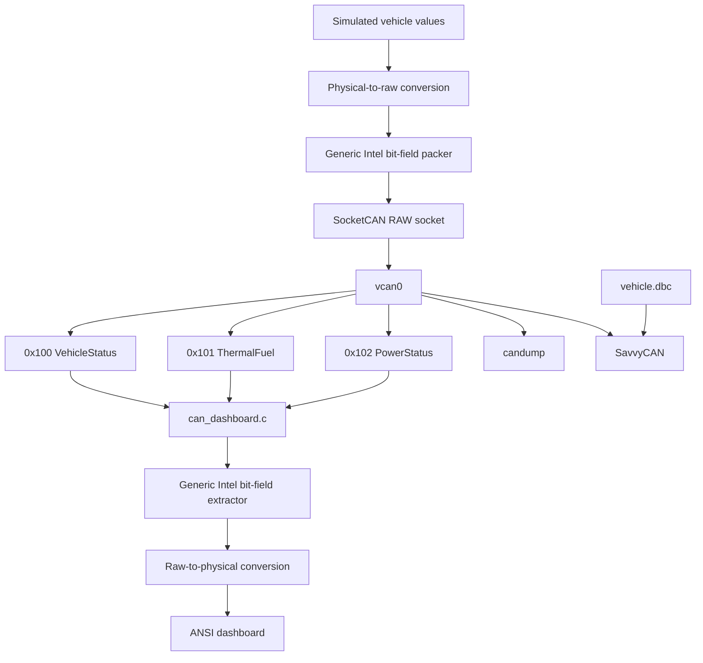
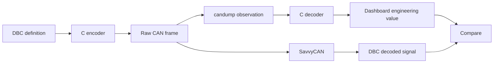

# AI-Assisted Automotive CAN Telemetry — SocketCAN Version B

This repository implements a complete virtual automotive CAN telemetry network on Linux. It uses a Vector-style DBC file, Linux SocketCAN, and the `vcan0` virtual CAN interface.

The project is deliberately organized differently from a basic byte-copy implementation: the transmitter and dashboard use reusable generic Intel/little-endian bit-field helpers. The signal positions are also different from the other submission while preserving the assignment's required six signals, message IDs, scaling, and offsets.

## 1. What the Assignment Is Asking You to Build

At a high level, there are five deliverables:

1. `vehicle.dbc` — the formal CAN database.
2. `can_transmitter.c` — creates simulated physical vehicle values, converts them to raw CAN values, packs the bits, and transmits the three frames.
3. `can_dashboard.c` — receives the frames, extracts the raw signal values, converts them back to engineering units, and displays them.
4. `AI_USAGE_REPORT.md` — documents AI-assisted development and human verification.
5. `README.md` — explains the architecture, mathematics, testing, SavvyCAN workflow, and deployment.

The six signals are distributed as follows:

| CAN ID | Decimal | Message | Signal | Start Bit | Length | Byte Order | Factor | Offset | Physical Range | Unit |
|---|---:|---|---|---:|---:|---|---:|---:|---|---|
| `0x100` | 256 | `VehicleStatus` | `VehicleSpeed` | 0 | 16 | Intel / Little | 0.01 | 0 | 0–120 | km/h |
| `0x100` | 256 | `VehicleStatus` | `EngineRPM` | 16 | 16 | Intel / Little | 1.0 | 0 | 800–5000 | rpm |
| `0x101` | 257 | `ThermalFuel` | `CoolantTemperature` | 32 | 11 | Intel / Little | 0.1 | -40 | -40–120 | degC |
| `0x101` | 257 | `ThermalFuel` | `FuelLevel` | 48 | 8 | Intel / Little | 0.5 | 0 | 0–100 | % |
| `0x102` | 258 | `PowerStatus` | `BatteryVoltage` | 0 | 12 | Intel / Little | 0.01 | 0 | 11–15 | V |
| `0x102` | 258 | `PowerStatus` | `AmbientTemperature` | 24 | 8 | Intel / Little | 1.0 | -40 | -40–100 | degC |

## 2. System Architecture



## 3. Repository Structure

```text
AI-Assisted-DBC-SocketCAN-Version-B/
├── vehicle.dbc
├── can_transmitter.c
├── can_dashboard.c
├── AI_USAGE_REPORT.md
├── README.md
├── START_HERE.md
├── Makefile
└── .gitignore
```

## 4. Understanding the Encoding Math

Every CAN signal is defined by a factor and an offset.

### Encoding

```text
Raw = (Physical - Offset) / Factor
```

### Decoding

```text
Physical = Raw × Factor + Offset
```

The transmitter uses the first equation. The dashboard uses the inverse equation.

### Example: Coolant Temperature

The DBC defines:

```text
Factor = 0.1
Offset = -40
```

For `85 degC`:

```text
Raw = (85 - (-40)) / 0.1
    = 1250
```

Decoding gives:

```text
Physical = 1250 × 0.1 + (-40)
         = 85 degC
```

### Example: Battery Voltage

```text
Factor = 0.01
Offset = 0
```

For `13.80 V`:

```text
Raw = 13.80 / 0.01
    = 1380
```

## 5. Bit-Level Layout

This version intentionally separates some signals inside the eight-byte CAN payload instead of placing every signal at the beginning of the frame.

### `0x100` — VehicleStatus

```text
Bit range:  0........15  16........31  32........................63
            +----------+-------------+----------------------------+
            | Speed    | Engine RPM  | Reserved                    |
            +----------+-------------+----------------------------+
```

### `0x101` — ThermalFuel

```text
Bit range:  0........31  32........42  43.......47  48.......55  56....63
            +------------+------------+------------+------------+--------+
            | Reserved   | Coolant    | Reserved   | Fuel       | Spare  |
            +------------+------------+------------+------------+--------+
```

This placement demonstrates that the decoder cannot simply assume every signal starts at byte zero.

### `0x102` — PowerStatus

```text
Bit range:  0.........11  12.......23  24.......31  32................63
            +-------------+-----------+-----------+---------------------+
            | Battery     | Reserved  | Ambient   | Reserved            |
            +-------------+-----------+-----------+---------------------+
```

## 6. Why Generic Bit Packing Is Used

The transmitter does not depend on a separate hard-coded routine for every byte arrangement. Instead, `set_intel_bits()` receives:

- destination byte array;
- start bit;
- signal length;
- raw signal value.

The dashboard contains the inverse `get_intel_bits()` function.

This makes the implementation easier to audit against a DBC start-bit/length definition.

## 7. Linux Software Requirements

On Debian/Ubuntu:

```bash
sudo apt update
sudo apt install -y build-essential can-utils iproute2 git
```

Optional GitHub CLI:

```bash
sudo apt install -y gh
```

Check the tools:

```bash
gcc --version
git --version
ip -V
candump --help | head
```

## 8. Create the Virtual CAN Interface

Load the module:

```bash
sudo modprobe vcan
```

Create the interface:

```bash
sudo ip link add dev vcan0 type vcan
```

If Linux reports that `vcan0` already exists, do not create it again. Bring it up with:

```bash
sudo ip link set vcan0 up
```

Verify it:

```bash
ip -details link show vcan0
```

A working setup should show a CAN interface named `vcan0` and the interface should be `UP`.

## 9. Build the Project

### Method A — Makefile

```bash
make clean
make
```

The output binaries are:

```text
can_transmitter
can_dashboard
```

### Method B — direct GCC commands

```bash
gcc -std=c11 -Wall -Wextra -Wpedantic -O2 can_transmitter.c -lm -o can_transmitter
gcc -std=c11 -Wall -Wextra -Wpedantic -O2 can_dashboard.c -o can_dashboard
```

## 10. Run the Complete Demonstration

Use three terminal windows.

### Terminal 1 — raw CAN monitor

```bash
candump vcan0
```

Leave it running.

### Terminal 2 — decoded dashboard

```bash
./can_dashboard
```

Leave it running.

### Terminal 3 — telemetry transmitter

```bash
./can_transmitter
```

The transmitter sends all three frames every 100 ms.

## 11. Expected Raw Traffic

You should see three identifiers repeatedly:

```text
vcan0  100   [8]  XX XX XX XX XX XX XX XX
vcan0  101   [8]  XX XX XX XX XX XX XX XX
vcan0  102   [8]  XX XX XX XX XX XX XX XX
```

The payload changes continuously because the transmitter uses smooth mathematical signal drift.

## 12. Useful `candump` Filters

Only `0x100`:

```bash
candump vcan0,100:7FF
```

Only `0x101`:

```bash
candump vcan0,101:7FF
```

Only `0x102`:

```bash
candump vcan0,102:7FF
```

All three messages can be monitored with:

```bash
candump vcan0
```

## 13. Manual Bit-Packing Verification

A useful sanity check is to examine one frame from `candump` and compare the bytes with the DBC.

For `0x100`:

```text
bytes 0–1 = VehicleSpeed raw value
bytes 2–3 = EngineRPM raw value
```

For `0x101`:

```text
bits 32–42 = CoolantTemperature raw value
bits 48–55 = FuelLevel raw value
```

For `0x102`:

```text
bits 0–11 = BatteryVoltage raw value
bits 24–31 = AmbientTemperature raw value
```

Do not try to decode the decimal engineering value directly from the displayed hexadecimal bytes. First extract the raw integer, then apply the factor and offset.

## 14. SavvyCAN Workflow

SavvyCAN can be used as an independent GUI verification layer.

### Step 1 — Start the Linux CAN source

Make sure `vcan0` is up and the transmitter is running.

### Step 2 — Open SavvyCAN

Select a SocketCAN-compatible connection and choose `vcan0`. Menu wording can vary by SavvyCAN release.

### Step 3 — Verify the IDs

Confirm that traffic with IDs `100`, `101`, and `102` appears.

### Step 4 — Load the database

Import:

```text
vehicle.dbc
```

### Step 5 — Configure signal views

Create signal views/plots for:

- `VehicleSpeed`
- `EngineRPM`
- `CoolantTemperature`
- `FuelLevel`
- `BatteryVoltage`
- `AmbientTemperature`

### Step 6 — Compare results

The values shown by SavvyCAN should track the values printed by the transmitter and dashboard.

## 15. Validation Chain



The strongest validation is obtained when the same signal agrees through all three paths:

```text
physical transmitter value
        ↓
raw CAN bytes
        ↓
DBC/C decoded value
```

## 16. Screenshot / Evidence Checklist

For an assignment or GitHub project, useful evidence screenshots are:

1. `ip -details link show vcan0`
2. successful `make` output
3. Terminal 1 showing `candump vcan0`
4. Terminal 2 showing the dashboard
5. Terminal 3 showing transmitter values
6. all three CAN IDs visible together
7. SavvyCAN showing decoded signals or plots
8. GitHub repository showing the final files

Do not upload screenshots containing unrelated personal information.

## 17. Git Repository Setup

Create a local repository from the project folder:

```bash
git init
git branch -M main
git add vehicle.dbc can_transmitter.c can_dashboard.c AI_USAGE_REPORT.md README.md START_HERE.md Makefile .gitignore
git status
git commit -m "Add SocketCAN DBC telemetry project"
```

Connect it to the friend's GitHub repository. Replace the URL with the friend's actual repository URL:

```bash
git remote add origin https://github.com/GITHUB_USERNAME/REPOSITORY_NAME.git
git push -u origin main
```

Check the remote:

```bash
git remote -v
```

## 18. Updating the Repository Later

After making changes:

```bash
git status
git add .
git commit -m "Update CAN telemetry project"
git push
```

## 19. Clean Shutdown

Stop the transmitter and dashboard with:

```text
Ctrl+C
```

Optionally remove the virtual CAN interface:

```bash
sudo ip link delete vcan0
```

## 20. Final Technical Summary

The complete signal flow is:

```text
physical value
   ↓
raw conversion using factor/offset
   ↓
Intel bit packing
   ↓
CAN frame
   ↓
SocketCAN / vcan0
   ↓
CAN receiver
   ↓
Intel bit extraction
   ↓
inverse factor/offset conversion
   ↓
engineering value
```

The DBC is the reference contract. The C code must match it exactly. If a start bit, length, factor, offset, or identifier differs between the DBC and C implementation, the system may still transmit frames successfully but the decoded value will be wrong.
